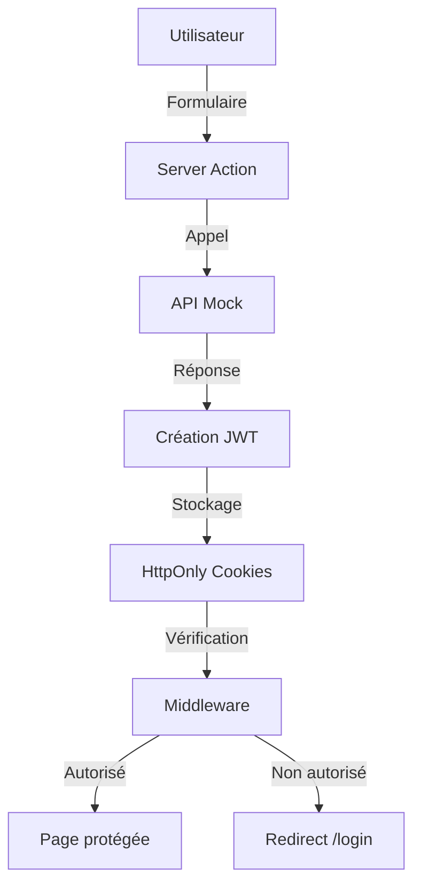

# 🔐 Système d'authentification Next.js

Ce projet implémente un système d'authentification complet avec Next.js 15, incluant la gestion des tokens JWT, des middlewares de protection de routes, et une API mock en attendant l'intégration du backend.

## 📋 Table des matières

- [Fonctionnalités](#fonctionnalités)
- [Technologies utilisées](#technologies-utilisées)
- [Installation](#installation)
- [Structure du projet](#structure-du-projet)
- [Fonctionnement](#fonctionnement)
- [Pages disponibles](#pages-disponibles)
- [Configuration](#configuration)
- [Intégration avec l'API backend](#intégration-avec-lapi-backend)
- [Sécurité](#sécurité)

## ✨ Fonctionnalités

- ✅ Inscription utilisateur
- ✅ Connexion / Déconnexion
- ✅ Protection des routes via middleware
- ✅ Gestion des tokens JWT (access + refresh)
- ✅ Stockage sécurisé des tokens (httpOnly cookies)
- ✅ Redirection automatique selon l'état de connexion
- ✅ Validation des formulaires avec Zod
- ✅ Server Actions Next.js 15
- ✅ UI moderne avec Tailwind CSS
- ✅ API mock prête pour l'intégration backend

## 🛠 Technologies utilisées

- **Next.js 15** - Framework React avec App Router
- **TypeScript** - Typage statique
- **Tailwind CSS** - Styling
- **jose** - Gestion des JWT
- **zod** - Validation des schémas
- **React Hook Form** (via Server Actions)

## 🚀 Installation

```bash
# Cloner le projet
git clone <votre-repo>
cd <votre-projet>

# Installer les dépendances
pnpm install

# Créer le fichier .env.local
cp .env.example .env.local

# Lancer le serveur de développement
pnpm dev
```

Le projet sera accessible sur [http://localhost:3000](http://localhost:3000)

## 📁 Structure du projet

```
src/
├── lib/                          # Utilitaires et logique métier
│   ├── auth.ts                   # Gestion des tokens JWT et sessions
│   ├── api.ts                    # API mock (à remplacer)
│   └── utils.ts                  # Fonctions utilitaires (cn)
│
├── components/
│   └── ui/                       # Composants UI réutilisables
│       ├── button.tsx
│       ├── input.tsx
│       └── label.tsx
│
├── app/
│   ├── actions/
│   │   └── auth.ts               # Server Actions (login, register, logout)
│   │
│   ├── (auth)/                   # Groupe de routes d'authentification
│   │   ├── login/
│   │   │   └── page.tsx          # Page de connexion
│   │   └── register/
│   │       └── page.tsx          # Page d'inscription
│   │
│   ├── dashboard/
│   │   └── page.tsx              # Dashboard (protégé)
│   │
│   ├── page.tsx                  # Page d'accueil
│   ├── layout.tsx                # Layout racine
│   └── globals.css               # Styles globaux
│
└── middleware.ts                 # Protection des routes
```

## 🔄 Fonctionnement

### 1. Architecture d'authentification



### 2. Flux de connexion

1. L'utilisateur remplit le formulaire de login
2. La Server Action `login()` valide les données avec Zod
3. L'API mock vérifie les credentials (actuellement : `test@example.com` / `password`)
4. Si valide : création de tokens JWT (access + refresh)
5. Stockage des tokens dans des cookies httpOnly
6. Redirection vers `/dashboard`

### 3. Protection des routes

Le middleware (`src/middleware.ts`) intercepte toutes les requêtes et :

- **Routes publiques** (`/`, `/login`, `/register`) : accessibles à tous
- **Routes protégées** (tout le reste) : nécessitent une authentification
- **Redirection intelligente** :
  - Non connecté + route protégée → `/login?redirect=<route>`
  - Connecté + `/login` ou `/register` → `/dashboard`

## 📄 Pages disponibles

### 🏠 Page d'accueil (`/`)
- Accessible aux visiteurs non connectés
- Présentation du projet
- Liens vers login/register
- Redirection automatique vers `/dashboard` si connecté

### 🔑 Login (`/login`)
- Formulaire de connexion
- Validation en temps réel
- Compte de test fourni
- Redirection vers `/dashboard` après connexion

**Compte de test :**
- Email : `test@example.com`
- Mot de passe : `password`

### ✍️ Register (`/register`)
- Formulaire d'inscription
- Validation des mots de passe
- Création automatique de session
- Redirection vers `/dashboard` après inscription

### 📊 Dashboard (`/dashboard`)
- **Protégé** : nécessite une authentification
- Affiche les informations utilisateur
- Bouton de déconnexion
- Interface moderne avec statistiques

## ⚙️ Configuration

### Variables d'environnement

Créer un fichier `.env.local` à la racine :

```env
# Secret pour signer les JWT (minimum 32 caractères en production)
JWT_SECRET=your-super-secret-key-change-this-in-production-min-32-chars

# URL de l'API (pour plus tard)
NEXT_PUBLIC_API_URL=http://localhost:3000
```

⚠️ **Important** : Ne jamais commit le fichier `.env.local` ! Il est dans `.gitignore`.

### Durée des tokens

Dans `src/lib/auth.ts`, vous pouvez ajuster :

```typescript
// Access token : 1 heure
const accessToken = await createToken({ user }, '1h');

// Refresh token : 7 jours
const refreshToken = await createToken({ user }, '7d');
```

## 🔌 Intégration avec l'API backend

Actuellement, le système utilise une **API mock** dans `src/lib/api.ts`. Voici comment intégrer votre vraie API :

### Étape 1 : Modifier `src/lib/api.ts`

Remplacer les fonctions mock par de vrais appels fetch :

```typescript
// AVANT (mock)
export async function loginApi(credentials: LoginCredentials): Promise<AuthResponse> {
  await new Promise(resolve => setTimeout(resolve, 800));
  
  if (credentials.email === 'test@example.com' && credentials.password === 'password') {
    return { user: { ... }, accessToken: '...', refreshToken: '...' };
  }
  
  throw new Error('Email ou mot de passe incorrect');
}

// APRÈS (vraie API)
export async function loginApi(credentials: LoginCredentials): Promise<AuthResponse> {
  const response = await fetch(`${API_BASE_URL}/auth/login`, {
    method: 'POST',
    headers: {
      'Content-Type': 'application/json',
    },
    body: JSON.stringify(credentials),
  });
  
  if (!response.ok) {
    const error = await response.json();
    throw new Error(error.message || 'Erreur de connexion');
  }
  
  return response.json();
}
```

### Étape 2 : Adapter les types si nécessaire

Si votre API retourne un format différent, ajustez l'interface `AuthResponse` :

```typescript
export interface AuthResponse {
  user: User;
  accessToken: string;  // ou "access_token" selon votre API
  refreshToken: string; // ou "refresh_token" selon votre API
}
```

### Étape 3 : Gérer les erreurs API

Adaptez la gestion d'erreur selon votre backend :

```typescript
if (!response.ok) {
  const error = await response.json();
  // Votre format d'erreur peut être différent
  throw new Error(error.message || error.error || 'Erreur');
}
```

### Endpoints attendus

Votre API doit exposer :

| Endpoint | Méthode | Body | Réponse |
|----------|---------|------|---------|
| `/auth/login` | POST | `{ email, password }` | `{ user, accessToken, refreshToken }` |
| `/auth/register` | POST | `{ name, email, password }` | `{ user, accessToken, refreshToken }` |
| `/auth/refresh` | POST | `{ refreshToken }` | `{ accessToken }` (optionnel) |

## 🔒 Sécurité

### Mesures implémentées

- ✅ **HttpOnly cookies** : les tokens ne sont pas accessibles via JavaScript
- ✅ **Secure flag** : cookies transmis uniquement en HTTPS (production)
- ✅ **SameSite=Lax** : protection contre CSRF
- ✅ **Validation Zod** : toutes les entrées utilisateur sont validées
- ✅ **Server Actions** : logique sensible côté serveur uniquement
- ✅ **JWT signés** : impossibles à modifier sans la clé secrète

### Recommandations pour la production

1. **Changez le JWT_SECRET** : utilisez une clé forte et unique
2. **Activez HTTPS** : obligatoire pour les cookies sécurisés
3. **Limitez les tentatives** : ajoutez un rate limiting sur login
4. **Ajoutez 2FA** : authentification à deux facteurs (optionnel)
5. **Logs de sécurité** : surveillez les tentatives de connexion
6. **Refresh token rotation** : invalidez les anciens tokens

## 🧪 Tests

### Tester le système

1. **Inscription** : Aller sur `/register` et créer un compte
2. **Connexion** : Utiliser `test@example.com` / `password`
3. **Protection** : Essayer d'accéder à `/dashboard` sans connexion
4. **Déconnexion** : Cliquer sur "Déconnexion" dans le dashboard
5. **Redirection** : Vérifier les redirections automatiques

### Compte de test

```
Email: test@example.com
Password: password
```

## 📝 TODO / Améliorations futures

- [ ] Intégrer la vraie API backend
- [ ] Ajouter la gestion du refresh token automatique
- [ ] Implémenter "Se souvenir de moi"
- [ ] Ajouter "Mot de passe oublié"
- [ ] Mettre en place un rate limiting
- [ ] Ajouter des tests unitaires et e2e
- [ ] Implémenter la vérification d'email
- [ ] Ajouter OAuth (Google, GitHub, etc.)

## 🤝 Contribution

1. Créer une branche : `git checkout -b feature/ma-feature`
2. Commit : `git commit -m 'Ajout de ma feature'`
3. Push : `git push origin feature/ma-feature`
4. Ouvrir une Pull Request

## 📄 Licence

Ce projet est sous licence MIT.

## 👥 Auteurs

Votre équipe - [Votre organisation]

---

**Questions ?** Ouvrez une issue sur le repo ! 🚀